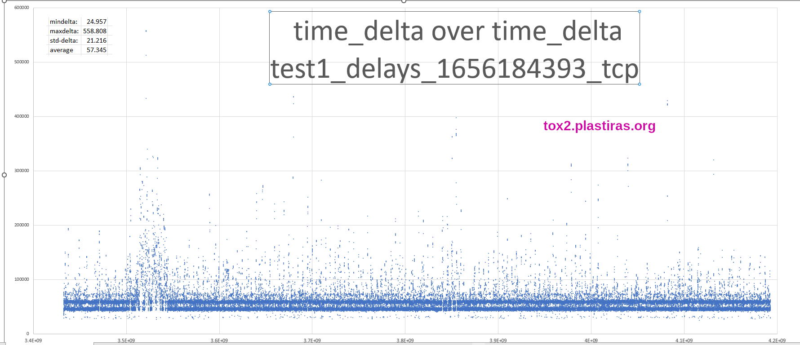

# tox delay tests

test environment for delay based congetion controll for file transfers

## delay test1

[raw data](res/test1)

### one-way-delay on tox.plastiras.org

### one-way-delay on tox2.plastiras.org in 2 zoom levels

## further resources:

https://www.bittorrent.org/beps/bep_0029.html#congestion-control

https://datatracker.ietf.org/doc/rfc6297/

